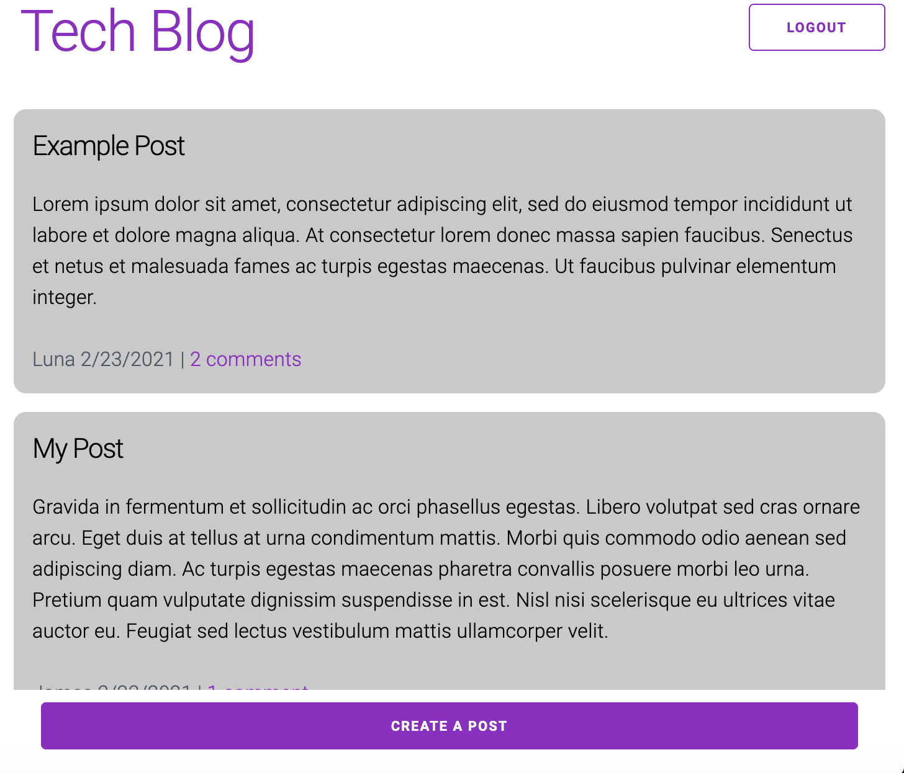
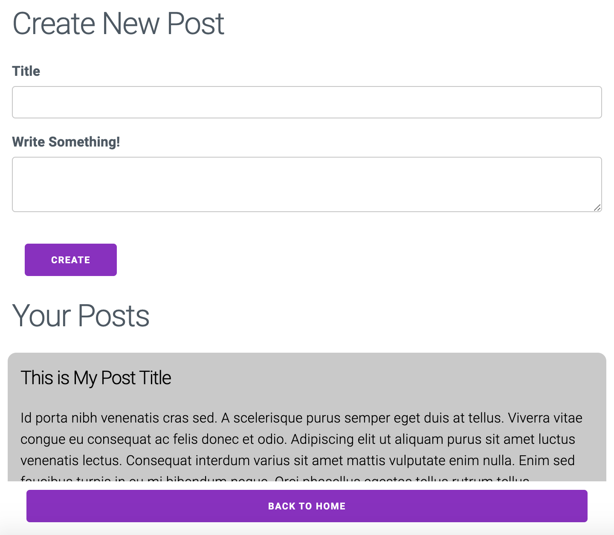
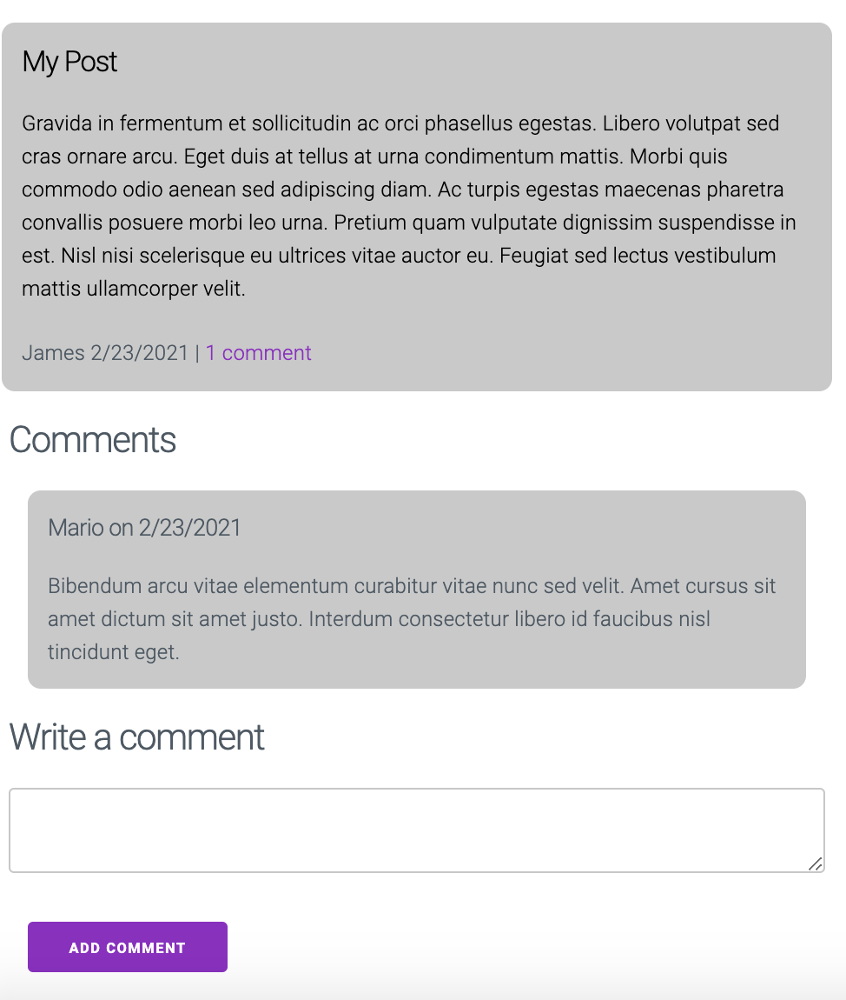

# tech-blog
## Description
A blogging platform where users can create posts and comment on the posts of other users.
## Table of Contents
* [Usage](https://github.com/kesiahp18/tech-blog#usage)
* [Technologies Used](https://github.com/kesiahp18/tech-blog#technologies)
* [Questions](https://github.com/kesiahp18/tech-blog#questions)
    
## Usage
Sign up and login on the login page and then navigate through the website, creating, viewing, and commenting on posts as desired.

## Technologies
* Node.js
* Javascript
* Express and Express-Session
* Dotenv
* Handlebars
* MySQL
* Sequelize
* Milligram

## Questions?
If you have any questions send an email to kesiahp18@gmail.com to have your questions answered.
Also visit my [GitHub profile](https://github.com/kesiahp18)
